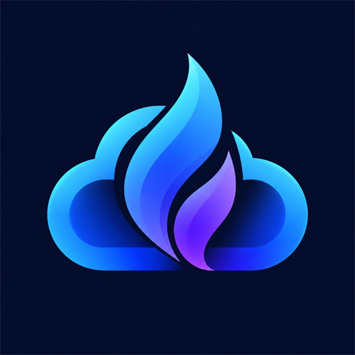

# BlazeGram

A modern, high-performance Android app for batch-uploading entire folders and subfolders to Telegram channels, groups, and chats — built with Jetpack Compose, TDLib, AndroidX Media3 Transformer, and iTunes Movie Metadata.

<p align="center">
  
</p>

BlazeGram connects directly to Telegram's native MTProto network via TDLib. It enables you to select any channel or chat, choose a local folder from Android storage, automatically transcode non-MP4 videos to MP4 using hardware acceleration, tag media with rich movie metadata and high-res posters from the iTunes API, and upload everything with real-time text message logs.

---

## Features

### 🔐 Telegram MTProto Authentication
- Direct native MTProto client connection via TDLib (`libtdjni.so`) — no Bot API limits.
- Multi-step login flow: API ID/Hash → Phone Number → OTP Verification → 2FA Cloud Password.
- Encrypted local session storage — stay logged in across app restarts.

### 📺 Channel & Chat Discovery
- Fast autocomplete search across all your subscribed channels, supergroups, basic groups, and private chats.
- Visual badges for channel types (`Channel`, `Supergroup`, `Group`, `Private Chat`).
- Active destination channel card with one-tap switching.

### 📁 Recursive Folder Navigation & Staging
- System file picker using Android Storage Access Framework (`ActivityResultContracts.OpenDocumentTree`).
- **Full Recursive Traversal**: Navigates all subdirectories, nested folders, and series seasons preserving relative folder hierarchies (e.g. `Season 1/Episode 01.mkv`).
- File preview showing individual file sizes, format detection, and total batch size.

### 🎬 Hardware-Accelerated MP4 Conversion
- Powered by Google's **AndroidX Media3 Transformer** (`androidx.media3:media3-transformer`).
- **Instant Transmuxing**: If MKV, WebM, or AVI files already contain compatible H.264/HEVC video and AAC audio, they are remuxed in seconds without re-encoding frames.
- **Hardware Transcoding**: Devices use hardware NPU/GPU encoders for fast, battery-efficient transcoding to H.264/AAC MP4.
- Lightweight: Zero bloated third-party C++ libraries (+1 MB APK addition vs +40 MB for FFmpeg).

### 🏷️ iTunes Movie Metadata & MP4 Tagging
- **Smart Title Normalization**: Automatically strips scene tags (`1080p`, `720p`, `x264`, `hevc`, `bluray`, `dts-hd`, `webrip`, release groups, bracketed tokens).
- **Apple iTunes Search API**: Fetches official movie title, release year, genre, plot synopsis, and high-res poster artwork (`600x600bb`) with no API key needed.
- **MP4 Container Tagging**: Injects standard iTunes MP4 atoms into the video container before uploading:
  - `©nam` (Title)
  - `©day` (Year)
  - `©gen` (Genre)
  - `desc` (Synopsis)
  - `covr` (Embedded cover poster image)
- **Telegram Poster Thumbnail**: Attaches the downloaded poster as `InputThumbnail` so Telegram displays the high-res movie poster in channel feeds.

### 📝 3-Phase Text Message Logging
- **Phase 1: Start Folder Log**:
  ```text
  📁 [START FOLDER UPLOAD]
  ━━━━━━━━━━━━━━━━━━━━━
  📂 Folder: Movies 2024
  📊 Total Files: 8 files (12.4 GB)
  ⚙️ MP4 Conversion: Enabled
  🏷️ iTunes Metadata: Enabled
  ⏰ Started at: 2026-09-20 16:30:00
  ```
- **Phase 2: Per-File Processing & Log**:
  Sends a rich text synopsis log for each file followed by the media upload:
  ```text
  🎬 [File 1/8: Processing Complete]
  ━━━━━━━━━━━━━━━━━━━━━
  🎥 Title: Spider-Man: Across the Spider-Verse (2023)
  🎭 Genre: Animation, Action
  📝 Synopsis: Miles Morales catapults across the Multiverse...
  📁 File: Season 1/Spider-Man.mp4 (2.1 GB)
  🏷️ Format: MP4 | iTunes Enriched
  ```
- **Phase 3: End Folder Log**:
  ```text
  ✅ [END FOLDER UPLOAD]
  ━━━━━━━━━━━━━━━━━━━━━
  📂 Folder: Movies 2024
  🎉 Status: All files successfully uploaded
  📊 Uploaded: 8 of 8 files
  ⏱️ Elapsed: 14m 20s
  🏁 Finished at: 2026-09-20 16:44:20
  ```

### 🛡️ Fault-Tolerant Queue Execution
- If any individual file fails during conversion or upload, the failure is logged to both the in-app Activity Terminal and the Telegram channel.
- The pipeline **automatically continues uploading all remaining files** in the folder queue without stopping or crashing.

### 🧹 Automatic Storage Cleanup
- **Zero Disk Waste**: Temporary converted `.mp4` videos, staged cache copies, and downloaded iTunes poster images are **immediately deleted** in a `finally` block once each file completes or fails.
- At the end of the batch, all staging and conversion directories are purged clean.

### 🎨 Obsidian Glassmorphism UI
- **Obsidian Mesh Canvas**: Deep obsidian dark background (`#080B1A`) with ambient radial mesh glows.
- **Electric Dual-Accent System**: Vivid Blue-Violet (`#6366F1`) and high-energy Electric Orange (`#F97316`).
- **Frosted Glass Components**: Translucent frosted cards, pill status badges, squircle glowing icon boxes, and an embedded terminal log viewer.

---

## Tech Stack

| Component | Technology |
|---|---|
| Language | Kotlin 2.2.10 |
| UI Framework | Jetpack Compose + Material 3 |
| Architecture | MVVM (ViewModel + StateFlow + Coroutines) |
| Navigation | AndroidX Navigation Compose |
| Telegram Client | [TDLib Android](https://github.com/capullo-tech/lib-tdlib-android) (Native MTProto JNI) |
| Media Transcoding | AndroidX Media3 Transformer 1.5.1 |
| Storage Access | Android Storage Access Framework (SAF) + DocumentFile |
| Image Loading | Coil Compose 2.7.0 |
| Min SDK | Android 8.0 (API 26) |
| Target SDK | Android 15 (API 37) |

---

## Architecture

```
┌─────────────────────────────────────────────────────────────────────────┐
│                           UI LAYER (Compose)                            │
│                 HomeScreen         │        SettingsScreen              │
└────────────────────────────────────▲────────────────────────────────────┘
                                     │ Observes StateFlow
┌────────────────────────────────────┴────────────────────────────────────┐
│                          VIEWMODEL LAYER                                │
│               TelegramViewModel    │     UploadViewModel                │
└────────────────────────────────────▲────────────────────────────────────┘
                                     │
┌────────────────────────────────────┴────────────────────────────────────┐
│                          MEDIA & PIPELINE LAYER                         │
│  BatchUploadManager ── Orchestrates Start Log, Per-File, End Log        │
│  Mp4Converter ──────── Hardware-accelerated Media3 Transformer (H264)   │
│  iTunesMetadataService ─ Filename cleaner, iTunes API & poster caching  │
│  Mp4MetadataTagger ─── MP4 box atom injector (©nam, ©day, ©gen, covr)   │
└────────────────────────────────────▲────────────────────────────────────┘
                                     │
┌────────────────────────────────────┴────────────────────────────────────┐
│                            DATA LAYER                                   │
│  TelegramRepository ── Singleton TDLib controller & file dispatcher     │
│  UserPreferences ────── SharedPreferences credential manager            │
└────────────────────────────────────▲────────────────────────────────────┘
                                     │ Native JNI (libtdjni.so)
┌────────────────────────────────────┴────────────────────────────────────┐
│                         TDLib Native Client                             │
│                       Telegram MTProto Servers                          │
└─────────────────────────────────────────────────────────────────────────┘
```

---

## Release APKs

Signed release APKs can be built via:
```powershell
.\gradlew.bat assembleRelease
```

The APKs are located under `app/build/outputs/apk/release/` and copied to `C:\Users\mahes\OneDrive\Documents\`:

| File | Target Architecture |
|---|---|
| `BlazeGram-arm64-v8a-release.apk` | 64-bit ARM Android Smartphones *(Recommended)* |
| `BlazeGram-universal-release.apk` | Universal (All ABIs included) |
| `BlazeGram-armeabi-v7a-release.apk` | 32-bit ARM Legacy Devices |
| `BlazeGram-x86_64-release.apk` | Emulators & Intel/AMD Android devices |

---

## License

Created for personal and authorized Telegram channel batch management.
